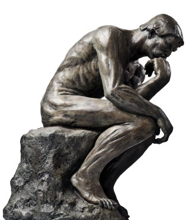

*Le penseur/The thinker © Rodin*

# Mathematical exercises #

This document contains some carefully selected problems and exercises from various fields of Mathematics.

Moreover, if you have any questions, suggestions or corrections to this document, please do not hesitate to contact the Author (preferably by e-mail).

---

### Author ###

* Dr. [Denys Dutykh](http://www.denys-dutykh.com/) ([CNRS](http://www.cnrs.fr/) - [INSMI](http://www.cnrs.fr/insmi/) - [LAMA UMR #5127](http://www.lama.univ-savoie.fr/index.php) - [Université Savoie Mont Blanc](http://www.univ-smb.fr/))
* Home page: [http://www.denys-dutykh.com/](http://www.denys-dutykh.com/)
* E-mail: " Denys . Dutykh at univ-savoie . fr "

---

### Changelog ###

V0.0.2: 2015/08/01

* An example with spike is added (from W. Kahan as well)
* Smooth surprise from W. Kahan
* List of Figures added

V0.0.1: 2015/07/04

* An exercise on Mueller's sequence
* One simple relativistic problem on the proper time is added
* Two extremal problems are added
* One general audience problem by V. Arnold is added
* A few problems on functions properties are added
